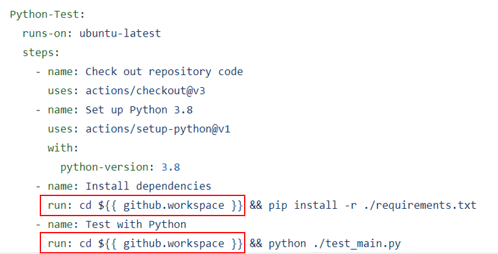

# 第八次作业
# 肖萍 41911082

## 作业要求：
使用 Github Action 或其他CI 服务，对你的仓库进行简单的构建、测试。

## 作业步骤：

1. 在 Github 仓库里面新建一个 .github/workflows 目录，再新建一个 github-actions-demo.yml 文件。

2. 在.yml文件中输入内容([具体内容](https://github.com/IpingXiao/hw/blob/master/.github/workflows/github-actions-demo.yml))

3. 向Github仓库添加main.py、requirements.txt和test_main.py代码

4. Github Actions运行结果

